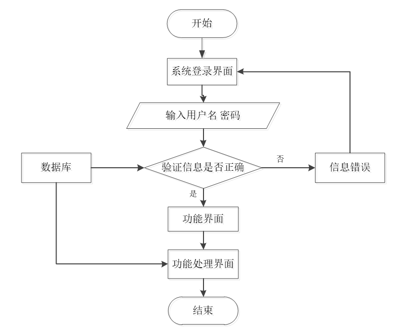
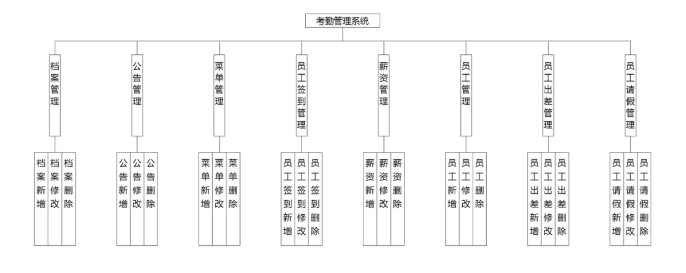
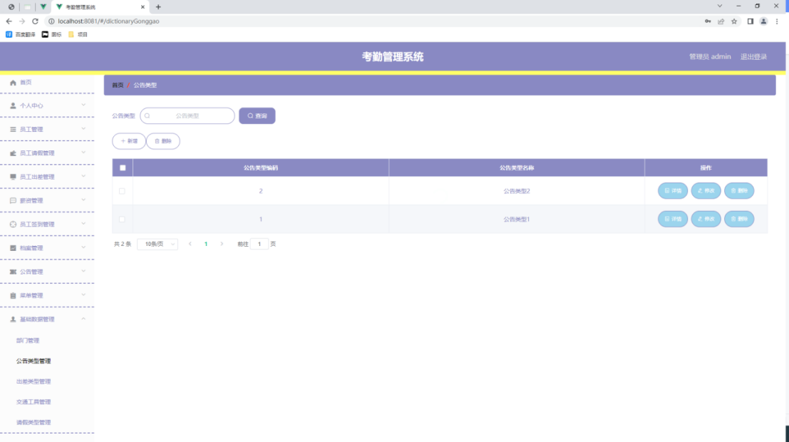
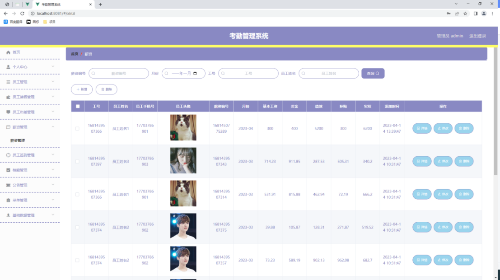
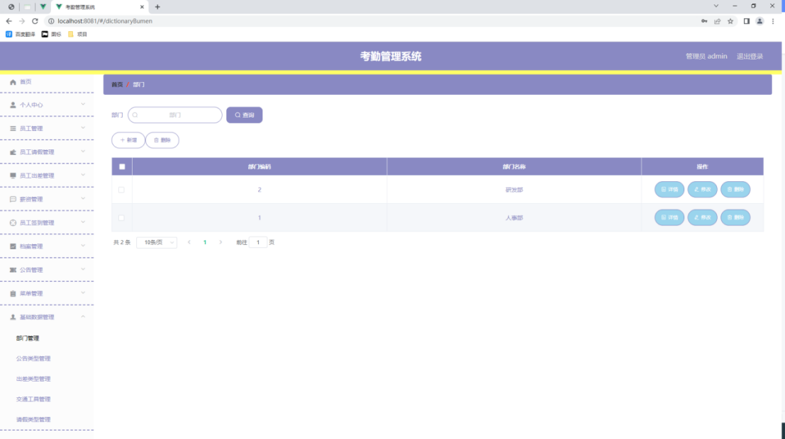
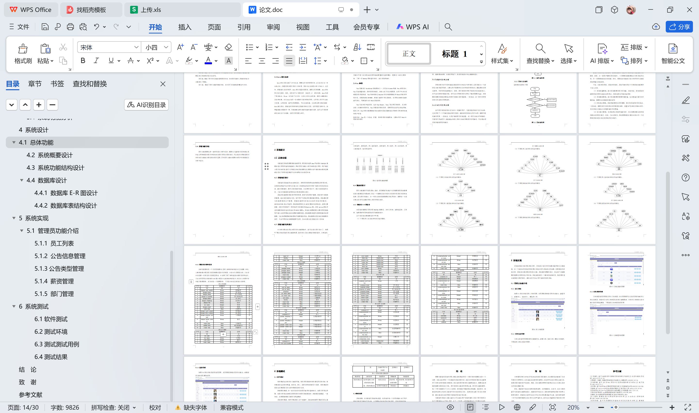

# springboot264-基于SpringBoot的考勤管理系统

>  博主介绍：
>  Hey，我是程序员Chaers，一个专注于计算机领域的程序员
>  十年大厂程序员全栈开发‍ 日常分享项目经验 解决技术难题与技术推荐 承接各类网站设计，小程序开发，毕设等。
>  【计算机专业课程设计，毕业设计项目，Java，微信小程序，安卓APP都可以做，不仅仅是计算机专业，其它专业都可以】

## 3000套系统可挑选，获取链接：https://chaerspol.github.io/

<b>QQ【获取完整源码】：674456564</b>

<b>QQ群【获取完整源码】：1058861570</b>

### 系统架构

> 前端：html | js | css | jquery | vue
>
> 后端：springboot | mybatis
> 
> 环境：jdk1.8+ | mysql | maven

# 一、内容包括
包括有  项目源码+项目论文+数据库源码+答辩ppt+远程调试成功

# 二、运行环境

> jdk版本：1.8 及以上； ide工具：IDEA； 数据库: mysql5.7及以上；编程语言: Java

# 三、需求分析

**3.1 系统可行性分析**

**3.1.1技术可行性分析**

本系统所需要的软件包括IDEA，Tomcat，MySQL等，这个工具早已触碰并用过，对于JAVA，B/S，Vue，HTML和其它技术，公共图书馆有明确的书可以参照学习培训，再加上一般在课堂上学习培训编程项目来描述这种技术，除此之外，我就从课题设计运行中能锻炼程序编写能力。因而，在技术上，能完成扶贫助农系统的编程开发。
通过上述剖析，明确了这一系统经济可行性、技术可行性及使用可行性。因而，能够得出结果，在目前环境下，扶贫系统设计和完成能够进行。

**3.1.2经济可行性分析**

开发的程序并不是向着商业服务程序方向设计与开发的，反而是做为一个新的论文新项目开发的。主要运用于检测学生们在学校所学的知识，塑造顾客使用互联网、书本等形式自学能力。因而，程序软件的开发不容易涉及到边际收入，也不会为软件的挑选付钱。你可以在开发软件的官网上下载所需要的app，并依据所需要的安装步骤将运用程序安装在你的电脑里。一般来说，这一程序的开发并没有社会经济发展成本。

**3.1.3运行可行性分析**

由于程序软件就是针对大部分一般操作用户，考虑到他的知识与文化水准，尤其开发了一个可操作度高的程序软件，能够轻而易举地让用户应用，数据可视化操作页面。一般来说，从用户操作程序的角度看，这一程序其实并不难操作。只需用户开启程序，就能避免专职人员学习培训开展程序作用操作，可以得出程序软件能够开发和操作。

**3.2 系统流程分析**

具体操作流程见下图。

# 四、功能模块

在分析并得出使用者对程序的功能要求时，就可以进行程序设计了。如图展示的就是管理员功能结构图，管理员在后台主要管理档案管理、字典管理、公告管理、菜单管理、员工签到管理、薪资管理、员工管理、员工出差管理、员工请假管理、管理员管理等。

# 五、效果图展示【部分效果图】

图5.1 员工列表页面【如图5.1显示的就是员工列表页面，此页面提供给管理员的功能有：查看员工、新增员工、修改员工、删除员工等。】

图5.2 公告信息管理页面【公告信息管理页面提供的功能操作有：新增公告，修改公告，删除公告操作。下图就是公告信息管理页面。】

图5.3 公告类型列表页面【公告类型管理页面显示所有公告类型，在此页面既可以让管理员添加新的公告信息类型，也能对已有的公告类型信息执行编辑更新，失效的公告类型信息也能让管理员快速删除。下图就是公告类型管理页面。】

图5.4薪资管理页面【如图5.4显示的就是薪资管理页面，此页面提供给管理员的功能有：新增薪资,修改薪资,删除薪资。】

图5.5 部门管理页面【如图5.5显示的就是部门管理页面，此页面提供给管理员的功能有：新增部门,修改部门,删除部门。】

 <b>完整文章</b>
 
 
 

## 3000套系统可挑选，获取链接：https://chaerspol.github.io/

<b>QQ【获取完整源码】：674456564</b>

<b>QQ群【获取完整源码】：1058861570</b>

